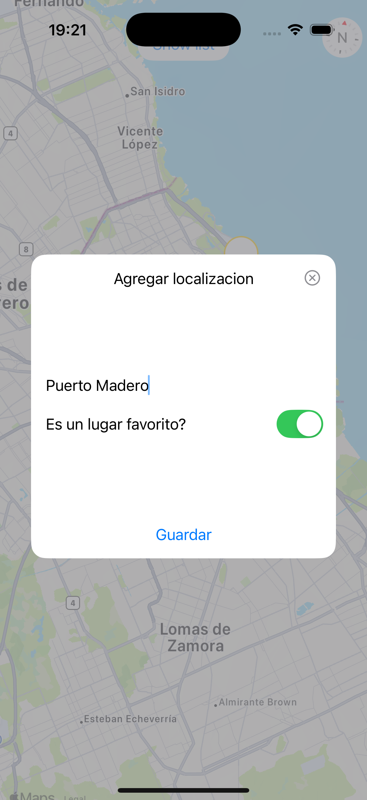
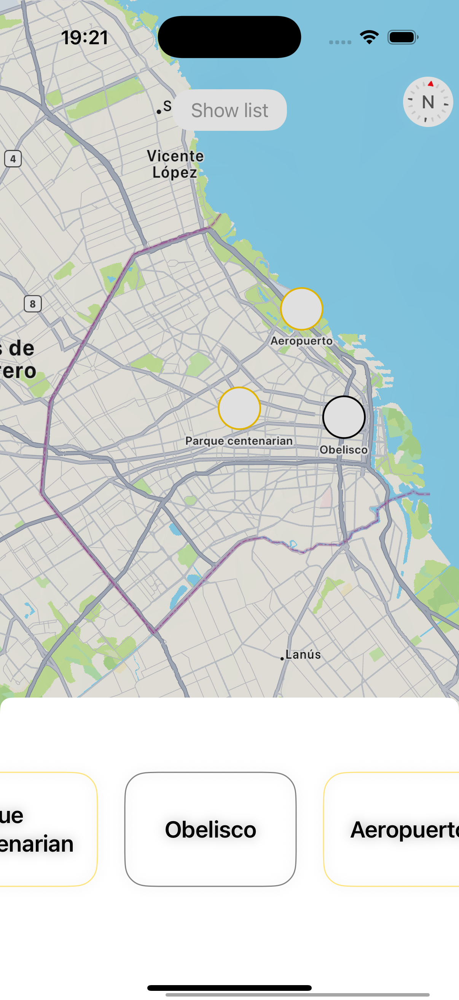

# 📍 Favorite Places Maps App – (IOS)

iOS application that allows users to select locations on a map, save them as favorites, and navigate back to them from a favorites list.  
The app uses **MapKit** and local data persistence to provide a simple and intuitive experience.

This project was developed as part of iOS training and demonstrates real-world usage of maps, markers, dialogs, sheets, and persistent storage.

---

## 🎥 App Demo

  

## 🛠 Tech Stack

- Swift
- UIKit
- MapKit
- CoreLocation
- UserDefaults + Codable
- Xcode
- iOS Simulator / Real Device

---

## 📸 Screenshots

<h3>Map View</h3>

  

<h3>Save Favorite</h3>

  

## 🧱 Architecture

This project follows a **simple and clean structure**, designed to keep the code readable and easy to understand.

Models represent the core data of the app, views handle user interface and interactions, and reusable UI components are separated to improve organization and maintainability.

### Project Structure

FavPlacesMaps
├── Components
│ └── CustomDialog
├── FavPlaces
│ ├── model
│ │ └── Place.swift
│ └── FavPlacesView
├── Assets
├── FavPlacesMapsApp
├── FavPlacesMapsTests
└── FavPlacesMapsUITests
